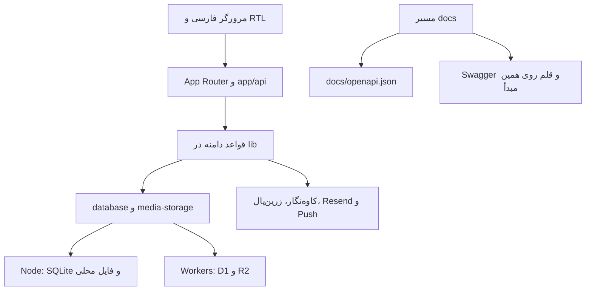

# معماری و ساختار پروژه

[فهرست مستندات](README.md)

## فناوری و مرزها

`package.json` از Next `16.3.4`، React `19.2.6`، vinext `1.0.0-beta.5`، Vite `8.0.13` و Drizzle ORM `0.45.2` استفاده می‌کند. مسیرها و اجزای React از قرارداد App Router پیروی می‌کنند، اما فرمان‌های موجود ساخت را با vinext/Vite انجام می‌دهند. بنابراین خروجی اصلی این مخزن `dist` است، نه فرض پیش‌فرض پروژه‌های استاندارد Next.

Routeها مسئول HTTP، احراز هویت، اعتبارسنجی ورودی و شکل پاسخ‌اند. منطق رزرو، موجودی، پرداخت، بلیت، رسانه و اعلان در `lib/` استفادهٔ مجدد می‌شود. بیشتر پرس‌وجوهای اجرایی SQL صریح با پارامتر bindشده هستند؛ Drizzle schema برای تعریف ساختار و تولید مهاجرت به کار می‌رود.

## نقشهٔ پوشه‌ها

| مسیر | مسئولیت |
| --- | --- |
| `app/` | صفحات، layout، loading و Route Handlerها |
| `app/api/` | ۵۸ مسیر API با ۸۷ عملیات صریح HTTP |
| `app/docs/` | HTML مستقل Swagger و خروجی JSON قرارداد |
| `components/evenline/` | رابط اصلی کاربر، کاتالوگ، ورود، خرید، پروفایل و برنامه |
| `components/event/` | پوسته، ناوبری، زمینهٔ ورود و ابزارهای مشترک رویداد و حساب |
| `components/content/` | صفحات محتوایی و ابزار مدیریت |
| `components/ui/` | اجزای عمومی و اجزای واردشده از shadcn |
| `hooks/` | دریافت منابع، علاقه‌مندی، ساعت مهلت و تعاملات رابط |
| `lib/` | قواعد دامنه، سازگارساز سرویس‌ها، قالب پاسخ و ابزارهای مشترک |
| `locales/` | متن فارسی رابط، دامنه و حریم خصوصی |
| `db/` | schema، binding Workers و آداپتور SQLite |
| `drizzle/` | SQL مهاجرت‌ها و journal |
| `public/` | قلم، آیکون، تصاویر، Service Worker و دارایی مستندات |
| `design-system/` | توکن‌های طراحی |
| `scripts/` | ساخت، نصب، مهاجرت، پشتیبان و اجرای کار اعلان |
| `deploy/` | نمونه‌های Nginx و systemd مربوط به استقرار قبلی |
| `tests/` | آزمون دامنه، HTTP، رسانه و بازبینی تصویری |
| `docs/` | راهنماهای فارسی، OpenAPI و شواهد طراحی |

## لایهٔ سرور

`lib/server.ts` توابع `boundary`، `json`، `body`، `sameOrigin`، `requireUser`، `requireAdmin` و `rateLimit` را فراهم می‌کند. `boundary` خطای شناخته‌شدهٔ `ApiError` را با status مشخص و خطای پیش‌بینی‌نشده را با 503 برمی‌گرداند. `json` پیش‌فرض `Cache-Control: no-store` دارد. مسیرهای رسانه، CSV و redirect پاسخ اختصاصی می‌سازند.

`db/node.ts` API مورد استفادهٔ D1 یعنی `prepare().bind().first/all/run` و `batch` را روی `DatabaseSync` بازاستفاده می‌کند. batch با تراکنش `BEGIN IMMEDIATE` اجرا می‌شود و درون آن await وجود ندارد. SQLite با foreign key، WAL، `busy_timeout=10000` و `synchronous=FULL` باز می‌شود. این طراحی برای یک سرویس Node و ذخیره‌سازی پایدار محلی است؛ اشتراک یک فایل SQLite میان چند میزبان راهکار این پروژه نیست.

## کلاینت

`lib/client.ts::api` درخواست هم‌مبدأ با کوکی نشست و بدون cache می‌فرستد و خطای API را به `ClientError` تبدیل می‌کند. `AppShell` وضعیت کاربر را از `/api/me` می‌گیرد. ناوبری در `components/event/app-navigation.tsx` متمرکز است؛ `AppLink` به‌دلیل مشکل ثبت‌شده در نسخهٔ vinext، prefetch را پیش‌فرض خاموش نگه می‌دارد.

کاتالوگ از API رکوردهای واقعی را می‌گیرد و فیلتر و جست‌وجو را در کلاینت انجام می‌دهد. دادهٔ پیش‌نویس خرید و تنظیمات نمایشی با وضعیت واقعی پرداخت یا ذخیرهٔ سرور یکسان نیستند. مهلت‌ها از زمان سرور و ابزارهای `lib/server-clock.ts` و `hooks/use-deadline-clock.ts` استفاده می‌کنند.

## مستندات وب

`app/docs/route.ts` یک سند HTML مستقل برمی‌گرداند تا پوسته، درخواست‌های حساب و CSS برنامه در Swagger دخالت نکنند. قرارداد از `docs/openapi.json` در زمان ساخت import و از `/docs/openapi.json` ارائه می‌شود؛ به فایل‌سیستم Node یا پایگاه داده وابسته نیست. این ویژگی روی Workers نیز کار می‌کند.

`swagger-ui-dist` با نسخهٔ ثابت نصب و دارایی‌های لازم با `scripts/prepare-docs.mjs` در ساخت کپی می‌شوند. نشانی سرور در قرارداد `/` است؛ Try it out به محیطی که صفحه روی آن باز شده درخواست می‌فرستد. اعتبارنامه‌های Authorize در ذخیره‌سازی پایدار نگهداری نمی‌شوند و اعتبارسنج خارجی Swagger خاموش است.

مقدار نمایشی پارامتر Origin از مبدأ مرورگر با `parameterMacro` پر می‌شود تا اعتبارسنج فرم Swagger درخواست را به‌دلیل خالی‌بودن آن متوقف نکند؛ هدر واقعی همچنان در اختیار مرورگر است. مرجع این گزینه [پیکربندی رسمی Swagger UI](https://swagger.io/docs/open-source-tools/swagger-ui/usage/configuration/) است.

## نکتهٔ طراحی (Learning Notes)

منطق SQL و قواعد دامنه بین دو محیط مشترک مانده‌اند و فقط مرز پایگاه داده و ذخیرهٔ رسانه عوض می‌شود. تغییر یک قاعدهٔ ظرفیت یا مالکیت باید روی هر دو محیط آزموده شود. OpenAPI توصیف قرارداد است؛ اعتبارسنج ورودی runtime یا تولیدکنندهٔ Route نیست.

## اهمیت تصمیم (Why This Matters)

این مرزبندی مانع دو نسخهٔ متفاوت از قواعد پرداخت و موجودی می‌شود. صفحهٔ مستقل مستندات نیز بدون تغییر مسیر اصلی یا افزودن وابستگی شبکه‌ای CDN، همراه همان انتشار برنامه قابل استفاده است.
