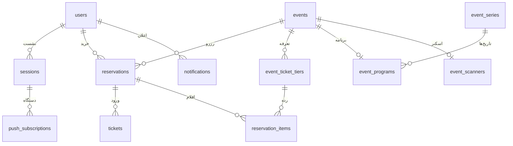

# مدل داده و مهاجرت

[فهرست مستندات](README.md)

مرجع تعریف جدول‌ها `db/schema.ts` و مرجع ساخت پایگاه موجود SQLهای `drizzle/` است. آداپتور Node همان SQL مورد استفادهٔ D1 را اجرا می‌کند. زمان‌ها معمولاً Unix epoch بر حسب میلی‌ثانیه، شناسه‌ها متن و مبلغ‌های دامنه عدد صحیح تومان هستند. نام فیلدهای API عمداً به قرارداد موجود وابسته‌اند و ترکیبی از snake_case و camelCase هستند.

## گروه جدول‌ها

| جدول | نقش و قید مهم |
| --- | --- |
| `users` | حساب با شمارهٔ یکتا و نام |
| `sessions` | هش توکن نشست، کاربر و زمان انقضا؛ توکن خام اینجا ذخیره نمی‌شود |
| `challenges` | کد پیامکی HMACشده، زمان انقضا، تعداد تلاش و consumed |
| `rate_limits` | شمارنده، پایان بازه و زمان آخرین عملیات برای هر کلید |
| `password_credentials` | هش scrypt رمز؛ یک رکورد برای هر کاربر |
| `password_reset_grants` | هش توکن یک‌بارمصرف بازیابی و انقضا |
| `user_profiles` | شهر، معرفی، URL آواتار، JSON علاقه‌ها و ترجیحات اعلان |
| `profile_media` | یک تصویر فعلی برای کاربر، کلید ذخیره و مشخصات فایل |
| `account_emails` | نشانی تأییدشده و زمان تأیید/فعال‌شدن ارسال |
| `email_challenges` | چالش محدود و یک‌بارمصرف تأیید ایمیل |
| `events` | میزبان، مکان، مختصات، زمان شروع/پایان/مهلت، قیمت، ظرفیت و انتشار |
| `event_media` | جلد و گالری؛ ترکیب رویداد/نقش/موقعیت یکتا |
| `event_series` | گروه تاریخ‌های یک میزبان |
| `event_programs` | برنامهٔ JSON، URL ویدیو، series_id و revision؛ یک رکورد برای رویداد |
| `event_ticket_tiers` | ردهٔ بلیت با قیمت، ظرفیت، ترتیب و active |
| `reservations` | سفارش، قیمت، وضعیت، snapshot خریدار و ارتباط درگاه |
| `reservation_items` | رده و snapshot نام/قیمت/تعداد بلیت در زمان خرید |
| `tickets` | توکن ورود برای هر واحد بلیت؛ ترکیب reservation/ordinal و token یکتا |
| `event_scanners` | کلید فعلی اسکنر هر رویداد |
| `organizer_follows` | ارتباط یکتای کاربر و برگزارکننده |
| `event_favorites` | ارتباط یکتای کاربر و رویداد ذخیره‌شده |
| `collections` | عنوان، توضیح، مالک، انتشار و تصویر مجموعه |
| `collection_events` | رویدادهای مجموعه، ترتیب و زمان عضویت |
| `collection_follows` | دنبال‌کنندگان مجموعه |
| `event_reviews` | یک نظر برای هر کاربر/رویداد؛ امتیاز، متن و وضعیت تعدیل |
| `review_replies` | یک پاسخ میزبان برای هر نظر و وضعیت تعدیل مستقل |
| `host_customer_metadata` | یادداشت و JSON برچسب‌ها، مختص زوج میزبان/مشتری |
| `notifications` | پیام داخلی و کلید رفع تکرار یکتا برای هر کاربر |
| `push_subscriptions` | endpoint یکتا، کلیدها و پیوند به نشست |
| `push_deliveries` | وضعیت ارسال هر اعلان/اشتراک، lease و تلاش بعدی |
| `email_deliveries` | گیرنده و نسخهٔ تأیید، lease، تلاش‌ها و شناسهٔ سرویس |
| `articles` | slug یکتا، محتوای Markdown، وضعیت و زمان انتشار |
| `article_media` | یک جلد فعلی برای هر مقاله |
| `site_content` | محتوای JSON با کلیدهای faq/about/contact و آخرین ویرایشگر |
| `contact_messages` | پیام ورودی و وضعیت new/in_progress/resolved |
| `mvp_migrations` | journal اختصاصی اجرای مهاجرت Node؛ در اسکریپت مهاجرت ساخته می‌شود |

نمودار روابط اصلی را نشان می‌دهد و جایگزین جزئیات foreign keyهای schema نیست؛ مثلاً نقش میزبان از env تعیین می‌شود و جدول مستقلی برای برگزارکننده وجود ندارد.

## رزرو و موجودی

`reservations` دارای یکتایی `(user_id, request_key)` است؛ retry شبکه نباید سفارش جدید بسازد. `authority` نیز یکتا است. snapshot خریدار (`attendee_name`، `attendee_phone`، `attendee_email`) از اطلاعات جاری پروفایل جداست. مبلغ تومان در `total` و مبلغ درگاه به ریال در `amount_rial` ذخیره می‌شود.

| وضعیت رزرو | معنا |
| --- | --- |
| `hold` | ظرفیت موقت برای پرداخت؛ اعتبار با expires_at سنجیده می‌شود |
| `confirmed` | رزرو نهایی؛ بلیت قابل صدور |
| `cancelled` | لغو مجاز رزرو رایگان |
| `failed` | درخواست پرداخت رد شده است |
| `paid_unfulfilled` | پرداخت تأیید شده ولی رزرو با موجودی/زمان فعلی قابل نهایی‌کردن نیست؛ نیازمند پیگیری |

`payment_state` مستقل است: `none`، `requesting`، `request_unknown`، `request_failed`، `pending`، `verification_pending`، `not_verified`، `paid` و `skipped_dev`. `confirmed` به‌تنهایی اثبات دریافت پول نیست؛ رزرو رایگان و عبور آزمایشی نیز confirmed می‌شوند. انقضای hold الزاماً رشتهٔ status را تغییر نمی‌دهد؛ queryهای موجودی فقط hold با انقضای آینده را حساب می‌کنند.

`lib/booking-sql.ts` و `lib/ticket-tiers.ts` بررسی ظرفیت را در همان INSERT/UPDATE انجام می‌دهند. اقلام سفارش رده‌دار همراه رزرو در batch ذخیره می‌شوند. تغییر نام یا قیمت رده، snapshot سفارش قبلی را تغییر نمی‌دهد. محدودیت موجودی هم در سطح رویداد و هم در سطح رده اعمال می‌شود.

## رسانه و نگهداری

دادهٔ باینری تصویر در SQLite/D1 نیست؛ جدول رسانه کلید فایل و MIME/اندازه را نگه می‌دارد. Node آن را در `MEDIA_PATH` و Workers در R2 ذخیره می‌کند. کلیدها UUID با پسوند مجازند و داده‌ها پس از نوشتن تغییر نمی‌کنند. تصاویر قدیمی آواتار/مقاله فوراً از ذخیره‌سازی پاک نمی‌شوند تا snapshot هم‌زمان پشتیبان معتبر بماند. پاک‌سازی دستی فایل بدون بررسی ارجاع‌ها می‌تواند تصاویر یا پشتیبان در حال تهیه را خراب کند.

## مهاجرت

`drizzle/meta/_journal.json` ترتیب اعمال را مشخص می‌کند. `scripts/migrate-node.mjs` هر فایل را در تراکنش اجرا و نام، checksum و زمان اعمال را ثبت می‌کند. اجرای دوباره بدون تغییر فایل انجام‌شده بی‌اثر است؛ تغییر checksum باعث توقف می‌شود.

برای تغییر schema، ابتدا تعریف و migration جدید را بسازید و SQL را با رفتار واقعی SQLite/D1 بازبینی کنید. مهاجرت `0012_push_session_revocation.sql` نمونه‌ای از trigger صریح برای رفع تفاوت خروجی ابزار در لغو نشست است؛ صرف موفقیت تولید schema کافی نیست. پیش از اعمال روی دادهٔ موجود، پایگاه و رسانه را با هم پشتیبان بگیرید. حذف یا بازگردانی migration در این پروژه دستور خودکار عمومی ندارد؛ روش بازگشت باید برای همان تغییر طراحی شود.
