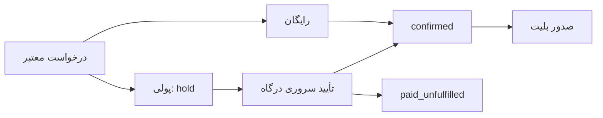

# جریان‌های کاربردی و مسیرهای برنامه

[فهرست مستندات](README.md) · [مرجع API](api.md)

## کاربر و کشف رویداد

صفحهٔ `/welcome` شروع آشنایی، `/onboarding` انتخاب شهر، برگزارکننده و علاقه‌ها، `/` کاتالوگ و `/?layout=v2` چیدمان دوم خانه است. `/events` و `/events/free`، `/filters` و `/map` برای مرور و فیلترند. API کاتالوگ فهرست رویدادهای منتشرشدهٔ آینده را می‌دهد؛ جست‌وجو، دسته‌بندی و مرتب‌سازی نمایشی سمت کلاینت است.

`/events/[id]` جزئیات واقعی رویداد، گالری، برگزارکننده، برنامه، ویدیوی تنظیم‌شده و تاریخ‌های سری را نمایش می‌دهد. اطلاعات مکان از دادهٔ رویداد می‌آیند. پیشنهادها در `lib/recommendations.ts` از سابقهٔ رزرو، دسته و فروش واقعی استفاده می‌کنند؛ [نقشه](map-provider.md) و [رابط](ui.md) جزئیات نمایش را توضیح می‌دهند.

## ورود و حساب

`/login` ورود پیامکی یا رمز حساب موجود، `/signup` ثبت‌نام و `/forgot-password` بازیابی است. `/host/login` و `/admin/login` مسیرهای ورود مرتبط با پنل‌اند؛ مجوز واقعی همچنان در API بررسی می‌شود. ثبت‌نام کد پیامکی را مستقیم مصرف می‌کند؛ پیش از آن فراخوانی verify جداگانه نکنید، چون کد یک‌بارمصرف است.

`/account` خلاصهٔ حساب، `/account/edit` و `/account/details` ویرایش نام/عکس/شهر/معرفی، `/settings` تنظیمات عمومی، `/settings/email` تأیید ایمیل و `/settings/notifications` ترجیحات اعلان هستند. `/settings/language` فارسی را به‌عنوان زبان موجود نمایش می‌دهد. ایمیل ثبت‌شده هنگام خرید با ایمیل تأییدشدهٔ حساب و رضایت ارسال خبرنامه یکسان نیست.

## رزرو و پرداخت

۱. از `/events/[id]/tickets` تاریخ واقعی رویداد و رده/تعداد بلیت انتخاب می‌شود. هر سفارش ۱ تا ۶ بلیت دارد.
۲. جزئیات خریدار و انتخاب‌ها آماده و یک `requestKey` برای همان سفارش ساخته می‌شود. تکرار ارسال همان سفارش باید همان کلید را داشته باشد.
۳. `POST /api/reservations` قیمت و ظرفیت را در سرور بررسی می‌کند. رزرو رایگان confirmed می‌شود. رزرو پولی hold با مهلت ۱۵ دقیقه و `paymentUrl` می‌گیرد.
۴. مرورگر به درگاه می‌رود. `/api/payments/callback` نتیجه را با سرور درگاه بررسی و با 303 به صفحهٔ رزروها برمی‌گرداند.
۵. پرداخت نامعلوم قابل verify/retry است. پرداخت موفقی که ظرفیت یا زمان دیگر اجازهٔ نهایی‌شدن نمی‌دهد، paid_unfulfilled می‌شود و در پنل میزبان نیاز به پیگیری دارد.

`/reservations` تاریخچه، `/reservations/[id]` جزئیات، `/reservations/[id]/qr` اعتبارنامهٔ ورود و `/account/receipt` ابزار رسید را نمایش می‌دهند. API بلیت و رسید JSON می‌دهد؛ `lib/ticket-pdf.ts` و `lib/receipt-pdf.ts` PDF را در مرورگر تولید می‌کنند. لغو فقط برای رزرو رایگان تأییدشده پیش از شروع و بدون بلیت اسکن‌شده مجاز است. بازپرداخت پولی خودکار وجود ندارد.

## میزبان و ورود شرکت‌کنندگان

`/host` فهرست و ساخت/انتشار رویداد و آمار فروش را ارائه می‌کند. `/host/events/[id]` شرکت‌کنندگان و جست‌وجو/CSV، زیرمسیرهای `tiers` و `program` مدیریت رده‌ها و برنامه هستند. سری تاریخ‌ها رویدادهای مستقل یک میزبان را گروه می‌کند؛ موجودی هر تاریخ مستقل می‌ماند.

میزبان لینک `/scanner#TOKEN` می‌سازد. صفحهٔ `/scanner` کلید را در هدر `X-Scanner-Key` می‌فرستد. ثبت ورود در SQL به رویداد، رزرو confirmed، توکن فعال اسکنر و یک‌بارمصرف‌بودن بلیت محدود است. اسکن دوباره پاسخ `already_checked_in` می‌دهد. چرخاندن لینک، اعتبار کلید قبلی را لغو می‌کند.

`/host/customers` مشتریانِ خرید تأییدشدهٔ همان میزبان، سابقه، یادداشت و برچسب را دارد. `/host/reviews` نظرهای رویدادهای او و ثبت پاسخ را فراهم می‌کند. ثبت پاسخ آن را به صف تعدیل می‌برد.

## اجتماع، محتوا و مدیریت

`/favorites` رویدادهای ذخیره‌شده، `/following` برگزارکنندگان دنبال‌شده، `/organizers/[id]` صفحهٔ برگزارکننده و `/collections/[id]` و زیرمسیر `edit` مجموعه‌ها هستند. مجموعه ابتدا خصوصی ساخته می‌شود و مالک، رویدادها و انتشار را تعیین می‌کند. دنبال‌کردن مجموعهٔ خصوصی یا مجموعهٔ خود مجاز نیست.

نظر فقط پس از پایان رویداد واقعی و برای رزرو معتبر قابل ثبت است. نظر جدید/ویرایش‌شده pending می‌شود؛ نمایش عمومی وابسته به تعدیل است. هر کاربر برای هر رویداد یک نظر دارد.

`/faq`، `/about`، `/contact`، `/privacy`، `/blog` و `/blog/[slug]` محتوای سایت را ارائه می‌کنند. مدیر از `/admin`، `/admin/content`، `/admin/articles`، `/admin/contact` و `/admin/reviews` محتوا، مقاله، پیام و نظر را مدیریت می‌کند. صفحه‌های بلاگ و محتوای عمومی از دسترسی سروری موجود استفاده می‌کنند؛ API عمومی مستقلی مانند `/api/articles` در پروژه وجود ندارد.

## اعلان‌ها

`/notifications` آخرین اعلان‌های حساب را نشان می‌دهد. رزرو تأییدشده هنگام صدور بلیت اعلان می‌گیرد؛ یادآوری‌ها، رویدادهای برگزارکننده، مجموعه و علاقه‌مندی و خبرنامه با کار زمان‌بندی تولید می‌شوند. نمایش اعلان داخل حساب، پذیرش پیام توسط سرویس و نمایش Push در دستگاه سه مرحلهٔ متفاوت‌اند. [راهنمای اعلان](notifications.md) تنظیم و حدود تحویل را مشخص می‌کند.
